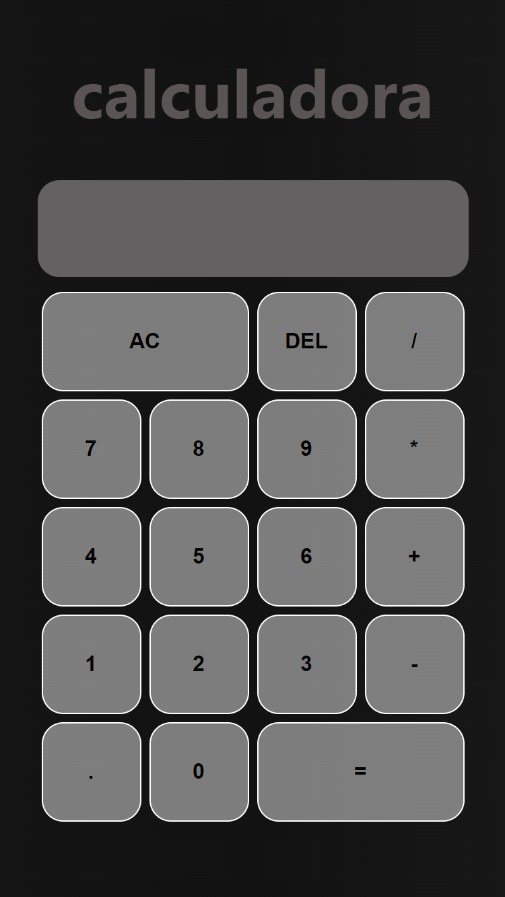

echo "# React Native Calculator 📱✨

A simple calculator app built with React Native.

## Table of Contents

- [Description](#description)
- [Screenshots](#screenshots)
- [Features](#features)
- [Installation](#installation)
- [Usage](#usage)
- [Contributing](#contributing)
- [License](#license)

---

## Description

This project is a basic calculator application developed using React Native, providing a user-friendly interface for performing fundamental arithmetic operations.

---

## Screenshots 🖼️

   

## Features 🚀

- Addition, subtraction, multiplication, and division operations
- Clear and delete functionalities
- Responsive layout for various screen sizes

---

## Installation 🛠️

1. **Clone the repository:**

   \`\`\`bash
   git clone <https://github.com/luis3698/Calculator.git>
   \`\`\`

2. **Navigate to the project directory:**

   \`\`\`bash
   cd react-native-calculator
   \`\`\`

3. **Install dependencies:**

   \`\`\`bash
   npm install
   \`\`\`

4. **Start the application:**

   \`\`\`bash
   npx react-native run-android  # For Android

# or

   npx react-native run-ios      # For iOS
   \`\`\`

---

## Usage 🚦

1. Open the application on your device or emulator.

2. Use the buttons to input numbers and perform operations.

3. The result will be displayed in the output area.

4. Press "AC" to clear all, "DEL" to delete the last digit, and "=" to get the result.

---

## Contributing 🤝

If you'd like to contribute to this project, feel free to submit issues or pull requests. Contributions are always welcome!

---

## License 📜

This project is licensed under the [MIT License](LICENSE.md)." > README.md
